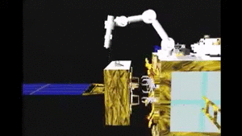

# SpaceDyn

**MATLAB Toolbox for the kinematic and dynamic analysis and simulation of space robots**

 

Author(s) and maintainer(s): [Space Robotics Lab.](http://www.astro.mech.tohoku.ac.jp/e/index.html)

[]

**This GitHub page is made based on the [original webpage of the Spacedyn](http://www.astro.mech.tohoku.ac.jp/spacedyn/) by current SRL member.** Please refer to the original webpage for more information.

## Overview
The Spacedyn is a MATLAB Toolbox for the kinematic and dynamic analysis and simulation of articulated multi-body systems with a moving base. Examples of such systems are a satellite with mechanical appendages, a free-flying space robot, a wheeled mobile robot, and a walking robot, all of which makes motions in the environment with or without gravity.

This toolbox can handle open chain systems with topological tree configuration. A parallel manipulator, for example, then cannot be supported directly. A walking robot contacting on the ground with more than two legs or limbs at a time seems to form a closed chain including the ground, however, we can handle such a system with a proper model of ground contact at each contact point. Parallel manipulators can be treated with virtual cut of a kinematic chain and a corresponding virtual force model.

Some academic papers regarding this toolbox is published by Kazuya Yoshida and his co-author(s) [1]. For the technical points of this software, please consult these papers as well as the following chapters of the document.

We hope that you could find this toolbox useful.

## Notice for user
* Now, the Spacedyn is Version 2, Release 0.
* The Spacedyn is a free software.
* You can download and use it freely for your academic purpose.
* Any of commercial use is kindly refused.
* There is no warranty for any damages caused by this software.
* If you intend to modify and re-distribute the Spacedyn, please consult us.
* The Spacedyn requires MATLAB 5.0 or higher. ( It uses functions that are not supported in 4.0 or lower )

## Publication
[1] Kazuya Yoshida et. al., "[The SpaceDyn: a MATLAB toolbox for space and mobile robots](https://ieeexplore.ieee.org/document/811712)", Proceedings of the 1999 IEEE/RSJ International Conference on Intelligent Robots and Systems. Human and Environment Friendly Robots with High Intelligence and Emotional Quotients (Cat. No.99CH36289), Kyongju, South Korea, 1999, pp. 1633-1638 vol.3, [doi: 10.1109/IROS.1999.811712](https://doi.org/10.1109/IROS.1999.811712).

## FAQ
For bug reports or any questions, please contact us via e-mail :

  spacedyn_support(at)astro.mech.tohoku.ac.jp

Please read the document for details, and [FAQ Page](http://www.astro.mech.tohoku.ac.jp/spacedyn/faq.html).
