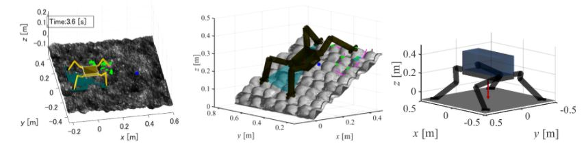

#1 ClimbLabとは

##1.1 Overview
ClimbLab(クライムラボ)とは，本研究室脚ロボチームで開発された「脚型クライミングロボット(Climbing Robot)のためのMATLABによる歩行シミュレーションプラットフォーム」である．対象とするロボットモデル・地形・環境・歩容計画(歩き方)・運動計画(動き方)を自由に設計してシミュレーションをおこなうことができる．

##1.2 Examples

###### Fig. 1. Examples of ClimbLab applications

具体的なClimbLabの適用例をFig. 1に示す．Fig. 1に示したように，昆虫型の関節配置のロボットを設定することも，哺乳類型の関節配置のロボットを設定することもできる．また歩行させる地形や，その斜度や重力などの環境も変更することができる．

##1.3 Open sourcing
様々なモデルを用いたロボットの挙動の分析が可能となる．GitHubにて学外的に公開している．