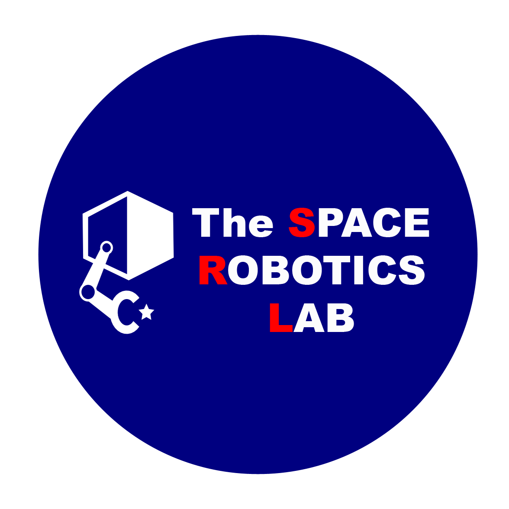

# SpaceDyn

 

Author(s) and maintainer(s): [Space Robotics Lab.](http://www.astro.mech.tohoku.ac.jp/e/index.html)

Contact email: srl-orbital(at)grp.tohoku.ac.jp

## Overview

* The SpaceDyn is a MATLAB/C++ library for the kinematic and dynamic analysis and simulation of articulated multi-body systems with a moving base. Examples of such systems are a satellite with mechanical appendages, a free-flying space robot, a wheeled mobile robot, and a walking robot, all of which makes motions in the environment with or without gravity.

* This toolbox can handle open chain systems with topological tree configuration. A parallel manipulator, for example, then cannot be supported directly. A walking robot contacting on the ground with more than two legs or limbs at a time seems to form a closed chain including the ground, however, we can handle such a system with a proper model of ground contact at each contact point. Parallel manipulators can be treated with virtual cut of a kinematic chain and a corresponding virtual force model.

* Some academic papers regarding this toolbox is published by Kazuya Yoshida and his co-author(s) [1]. For the technical points of this software, please consult those publications as well as the following chapters of this online user manual.

We hope that you could find this toolbox useful for your application. 

## Notice

* Now, the Spacedyn is Version 2, Release 0.
* The Spacedyn is a free software.
* You can download and use it freely for your academic purpose.
* Any of commercial use is kindly refused.
* There is no warranty for any damages caused by this software.
* If you intend to modify and re-distribute the Spacedyn, please consult us.
* The MATLAB toolbox of Spacedyn requires MATLAB 5.0 or higher. ( It uses functions that are not supported in 4.0 or lower.)

## Reference

!!! Note
    If you use this simulator in an academic context, please put the following citation.
    
[1] K.Yoshida, The SpaceDyn: a MATLAB toolbox for space and mobile robots, _Proc. IEEE/RSJ IROS_, pp. 1633--1638.

    @inproceedings{spacedyn,
      title={The SpaceDyn: a MATLAB toolbox for space and mobile robots},
      author={Kazuya Yoshida},
      booktitle={Proceedings 1999 IEEE/RSJ International Conference on Intelligent Robots and Systems},
      volume={3},
      pages={1633--1638},
      year={1999},
      doi={10.1109/IROS.1999.811712},
    }
    

This paper is available in [IEEE Xplorer](https://ieeexplore.ieee.org/document/811712).

## Release Note
* Oct.  7th, 1999, SpcaeDyn version 1 release 0 was released in [the original webpage](http://www.astro.mech.tohoku.ac.jp/spacedyn/).
* Sep. 17th, 2020, SpaceDyn version 2 release 0 was released in GitHub.
* Oct. 16th, 2020, SpaceDyn C++ was released in GitHub.
* May. 31th, 2024, SpaceDyn version 2 release 1 was released in GitHub.
    * Debug integral of base orientation (fixed `f_dyn_rk2` and `dc2qtn`, added `qtn2dc` and `w2dQtn`)
    
## FAQ

Please read this document for details, and [FAQ Page](http://www.astro.mech.tohoku.ac.jp/spacedyn/faq.html).

For bug reports or any questions, please contact us via e-mail :
    
    spacedyn_support(at)astro.mech.tohoku.ac.jp
    
or
    
    srl-orbital(at)grp.tohoku.ac.jp
    

## Acknowledgement
* SpaceDyn is originally developed and released by alumini of SRL listed in the [original dcument](http://www.astro.mech.tohoku.ac.jp/spacedyn/doc.pdf). 
* C++ version is developed by Dr. Satoko Abiko and Dr. Yoichiro Sato.
