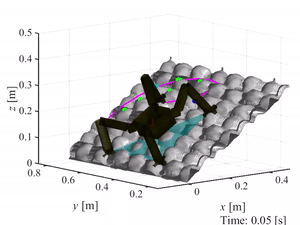

_ _ _

# SpaceDyn User Manual

_ _ _

Author(s) and maintainer(s): [Space Robotics Lab.](http://www.astro.mech.tohoku.ac.jp/e/index.html)

Contact email: srl-orbital@grp.tohoku.ac.jp

* The climbing simulator is being developed by the Climbing Robotics Team in [Space Robotics Laboratory](http://www.astro.mech.tohoku.ac.jp/e/index.html) at Tohoku University, Japan.

* The source code is released under a [BSD 3-Clause license](../../../LICENSE).

* This developpers manual is originally written in [Google Document and maintained in SRL-Limb's shared drive](https://docs.google.com/document/d/1wEOPXYscMYN4q2eXLOezcdTmEGJEJ6Ts37xntVeIqJo/edit).

## Reference

!!! Note
    If you use this simulator in an academic context, please put the following citation.

>Uno K. et al. (2022) ClimbLab: MATLAB Simulation Platform for Legged Climbing Robotics. In: Chugo D., Tokhi M.O., Silva M.F., Nakamura T., Goher K. (eds) Robotics for Sustainable Future. CLAWAR 2021. Lecture Notes in Networks and Systems, vol 324. Springer, Cham. https://doi.org/10.1007/978-3-030-86294-7_20

    @inproceedings{uno2021climblab,
      title={ClimbLab: MATLAB Simulation Platform for Legged Climbing Robotics},
      author={Kentaro Uno and Warley F. R. Ribeiro and Yusuke Koizumi and Keigo Haji and Koki Kurihara and William Jones and Kazuya Yoshida},
      booktitle={Robotics for Sustainable Future},
      pages={229--241},
      year={2022},
      publisher="Springer International Publishing",
    }

## Release note
The version of this manual is synchronized with the version of ClimbLab simulator. Since this online manual is deployed since the v4.0, the oldest version is v4.0.

- v4.0: released on 2021. First released version. 
